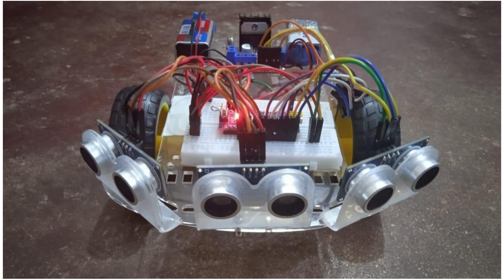
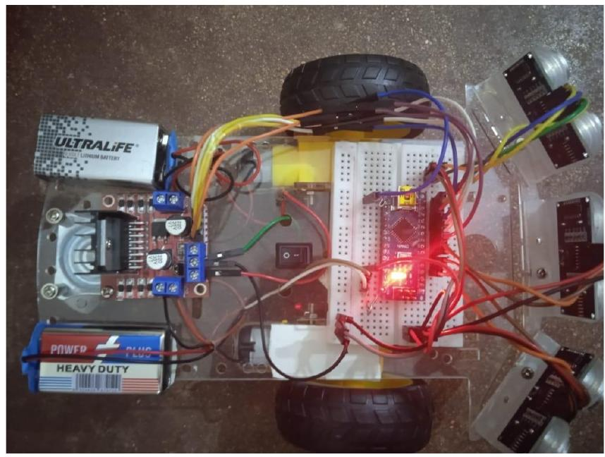

# Obstacle Avoiding Car

A small robot car which is able to detect obstacles in its way and avoid them. The brain of the car is programmed through Arduino, the obstacles are detected by ultasonic sensors, the motors are controlled by a motor driver, and tyres with strong grips are selected in order to provide a smooth turnover.

## Screenshots

## Demostration

Refer to [this video](https://drive.google.com/file/d/1nEnchumVxM4DWO4jIOzs4fwrC8J2_1GV/view?usp=sharing) to see a working demostration of our project.
 
## References

- [Research Paper](./Research_Paper.pdf) : Swinging Atwood’s Machine: experimental and theoretical studies, O Pujola, J P P ́erezb, J P Ramisc, C Sim ́od, S Simone, J A Weil.

## Last Updated

_May, 2021_
## Authors

- github : [@saad0510](https://www.github.com/saad0510)
- email  : k200161@nu.edu.pk or ayyansaad46@gmail.com

